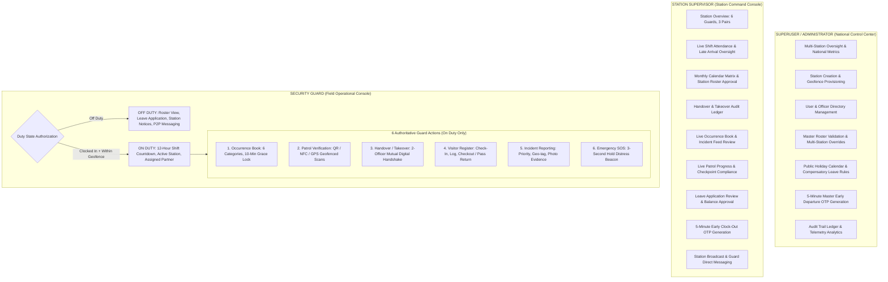
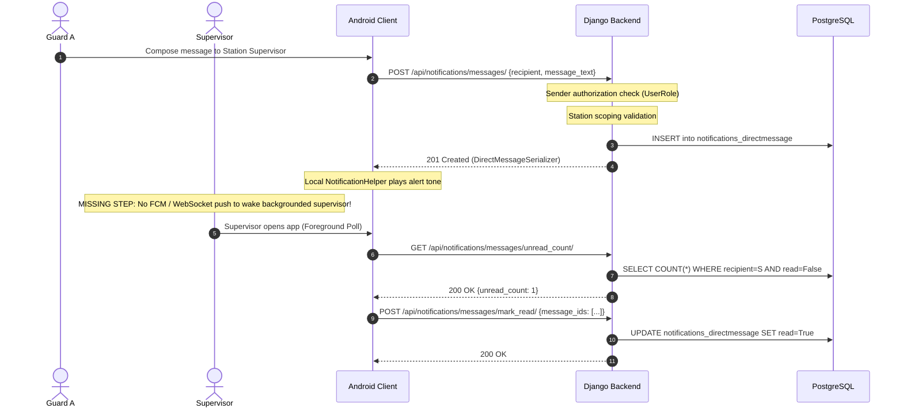
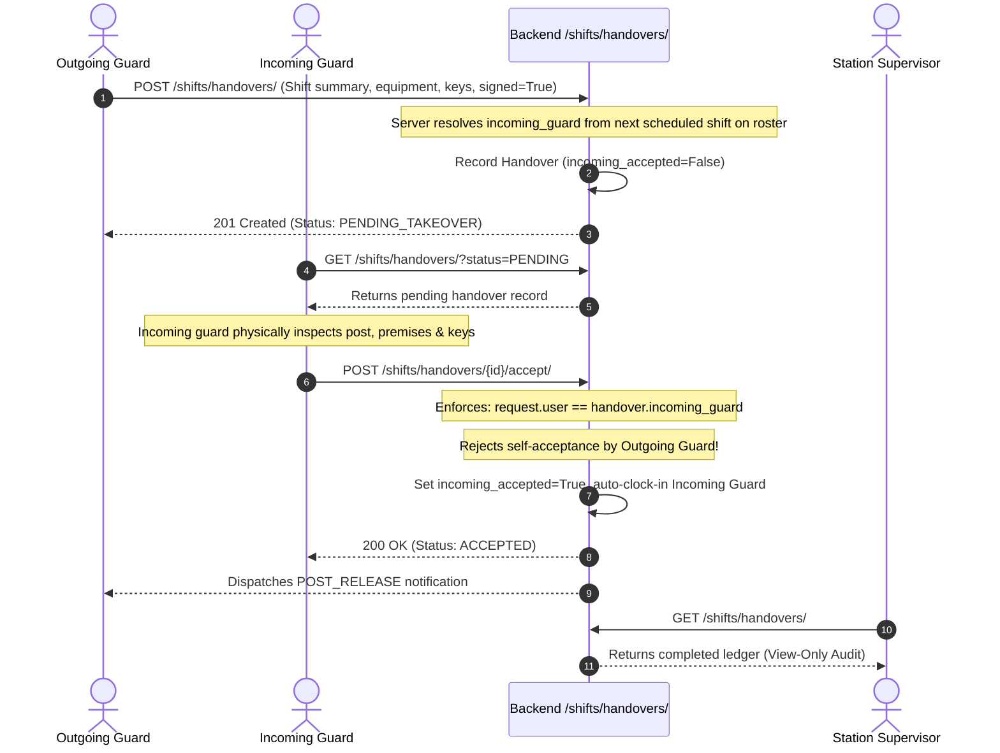
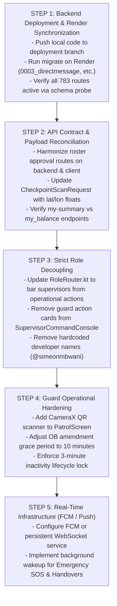

# SMART SECURITY
## PHASE 13 ARCHITECTURE + API CONTRACT AUDIT
### READ-ONLY

**Audit Date:** September 27, 2026  
**Audited Base:** `C:\Projects\SGMIS_FIXED\sgmis_fixed`  
**Authoritative Reference:** `C:\Projects\Smart Security Original Blueprint.zip` (`Smart Security Original Blueprint.pdf`)  
**Audit Mode:** Read-Only Technical Assessment & Root-Cause Forensic Audit (Strict Zero-Code-Modification Policy)  

---

## EXECUTIVE SUMMARY

Smart Security was conceived and specified in its authoritative product blueprint as an enterprise-grade guard-management and operational security ledger. Following field testing on physical Android hardware and live server log analysis, critical contract breakdowns emerged, including 9 distinct HTTP 404 Not Found errors, an HTTP 405 Method Not Allowed failure, and an operational fallback 404 failure.

This comprehensive read-only audit establishes:
1. **The Disconnect Between Local Code and Production (Render):**  
   The authoritative local repository (`sgmis_fixed`) possesses 783 resolved URL patterns with comprehensive implementations of Phase 12.6, 12.7, and 13 services. However, the production deployment at `https://sgmis-db.onrender.com/` is executing an outdated server image exposing only 98 endpoints. Critical endpoints (such as `/notifications/messages/`, `/core/telemetry/`, `/shifts/holiday-duties/`, `/shifts/duty-rosters/`, and `/shifts/shifts/duty_state/`) were never migrated or deployed to Render.
2. **Supervisor Role Contamination:**  
   The mobile application currently violates the core separation of duties defined in the blueprint by exposing Guard operational actions (personal patrols, occurrence book submission, SOS dispatch, and direct shift clock-ins) to Supervisors, rather than maintaining a pure command, oversight, and approval console.
3. **Payload & Routing Discrepancies:**  
   Specific client-server contract mismatches exist even when routes match—notably in patrol checkpoint scans (where Android sends GPS as a combined string rather than explicit latitude/longitude floats required by the backend proximity validator) and in roster approval chains (where 301 redirects and nonexistent collection routes trigger HTTP 405 / 404 cascades).
4. **Hardware Push Notification Absence:**  
   While foreground notification channels and alert ringtones are configured locally via `NotificationHelper`, there is no Firebase Cloud Messaging (FCM) or WebSocket push infrastructure. Consequently, background SOS alerts and handover transfers cannot reach offline or backgrounded supervisory personnel in real time.

---

## 1. BLUEPRINT ROLE MODEL

Grounding in `Smart Security Original Blueprint.pdf` (16 pages):



### A. Guard Interface Requirements
- **Duty State Differentiation:**
  - **Guard Off Duty:** Retains full application access (login, profile, personal monthly roster matrix, leave balances, leave applications, station notices, unread alerts, and direct messaging with partner/supervisor). Barred from executing operational field actions.
  - **Guard On Duty:** Activated strictly upon server-authoritative attendance clock-in within the verified station geofence radius. Displays active station, assigned partner name and live status, and real-time 12-hour countdown timer.
- **6 Primary Operational Actions (Exclusively On-Duty):**
  1. *Occurrence Book (OB):* Real-time ledger entries across 6 distinct categories. Evidence-grade immutability with an authoritative 10-minute edit grace period, after which records lock permanently. Deletion strictly prohibited.
  2. *Patrol Verification:* Checkpoint verification using physical QR tokens, NFC tags, or validated GPS proximity within station geofence. Premature completion or missed checkpoints flag supervisory alerts.
  3. *Handover / Takeover:* Mandatory 2-officer handshake. Outgoing guard registers post summary, equipment, and keys; incoming guard physically checks premises and confirms receipt. Mutual digital signatures required.
  4. *Visitor Management:* Visitor check-in (visitor ID, name, host, purpose, vehicle license) and active visitor tracking with mandatory checkout (departure timestamp and pass surrender).
  5. *Incident Reporting:* Real-time incident logging with priority/severity ratings, GPS coordinates, and photo evidence.
  6. *Emergency SOS:* 3-second deliberate hold activation. Triggers immediate local siren/strobe alert, continuous high-accuracy GPS tracking, and dispatches Priority-1 distress beacons to station supervisors and central dispatch.
- **Session Security:** 3-minute inactivity auto-lock requiring quick PIN or biometric re-authentication.

### B. Supervisor Command Interface Requirements
- **Command & Oversight Only:** The supervisor is an operational manager, NOT a field guard.
- **Strict Role Boundaries:**
  - Supervisors MUST NOT be assigned to guard pairs or the 6-guard rotational cycle.
  - Supervisors MUST NOT clock into guard shifts.
  - Supervisors MUST NOT execute patrols or submit routine guard OB entries.
  - Supervisors MUST NOT self-handover or act as an incoming/outgoing guard.
- **Core Functions:**
  - Live Station Overview: Active guards, assigned pairs, on-duty countdowns, and real-time station posture.
  - Attendance & Late Arrivals: Real-time clock-in monitoring, GPS proximity verification, and late-arrival justification reviews.
  - Roster Oversight: Review station monthly rotation, inspect invariant compliance (4 days on, 8 days off, 3 pairs), and execute Station Roster Approval.
  - Handover Ledger: View-only verification of completed and disputed shift handovers.
  - Occurrence Book & Incident Feeds: Read-only chronological feed of all station events with filtering by guard and category.
  - Patrol Monitoring: Telemetry tracking of active patrol rounds and missed checkpoint alerts.
  - Leave Management: Adjudication of guard leave applications and tracking compensatory day accruals.
  - Early Departure Authorization: Generation of 5-minute single-use cryptographic OTPs for legitimate early clock-outs.
  - Station Communications: Scoped station broadcast alerts and 1-to-1 direct messaging with officers.

### C. Administrator / Superuser Interface (National Control Center)
- **Central Multi-Centre Command:** Comprehensive national overview spanning all regional stations and posts.
- **Master Administration:**
  - Station Provisioning: Creation, geographic coordinates, geofence radius configuration, and checkpoint allocation.
  - Personnel Directory: User provisioning, credential lifecycle, role assignment (Guard, Supervisor, Administrator), and station assignment.
  - National Roster Administration: Cross-station roster visibility, multi-station validation, and executive overrides.
  - Public Holiday & Compensation Engine: Maintenance of national public holiday dates, review of holiday duty records, and automatic crediting of +2 compensatory leave days for holiday shifts worked.
  - Master OTP Authority: Enterprise-wide generation and auditing of early departure override tokens.
  - Security Audit Trail & Telemetry: Complete immutable audit logs (`SecurityAuditEvent`, `SupervisorOverrideAudit`), database health, and telemetry analytics.

---

## 2. ROLE SEPARATION & SUPERVISOR CONTAMINATION ANALYSIS

### Current vs. Blueprint Role Model Matrix

| Role | Current Interface | Blueprint Interface | Incorrect Features Currently Shown |
| :--- | :--- | :--- | :--- |
| **GUARD** | `GuardDashboardScreen` with duty timer, partner status, and action cards. | Dual-state interface (Off-Duty hub vs. On-Duty operational console with 6 locked actions). | Action cards allow navigation to patrol/OB before clock-in; auto-lock is un-enforced; QR camera missing. |
| **SUPERVISOR** | `SupervisorCommandConsole` within [DashboardScreen.kt](file:///C:/Projects/SGMIS_FIXED/sgmis_fixed/app/src/main/java/com/example/ui/screens/DashboardScreen.kt) containing management cards alongside operational navigation shortcuts. | Pure Command & Oversight Console: Station overview, roster approval, leave management, OTP generator, live feeds. | **CRITICAL CONTAMINATION:** Direct shortcuts to Guard Patrol (`NavRoutes.PATROL`), Guard Handover (`NavRoutes.HANDOVER`), and Guard OB entry (`NavRoutes.OCCURRENCE_BOOK`). |
| **ADMINISTRATOR** | `SuperuserNationalControlCenter` with national metrics, station cards, OTP generation modal, and system actions. | National Control Center: Multi-station telemetry, station setup, user directory, holiday compensation, national audit logs. | Operational shortcuts to Handover and Occurrence Book; broken telemetry and holiday duty routes on Render. |

### Technical Analysis of Supervisor Contamination
1. **Routing Leaks in [RoleRouter.kt](file:///C:/Projects/SGMIS_FIXED/sgmis_fixed/app/src/main/java/com/example/ui/navigation/RoleRouter.kt#L81-L91):**
   In `RoleRouter.isRouteAllowed(route, role)`, the supervisor role is permitted to navigate to all operational routes:
   ```kotlin
   AppRole.SUPERVISOR -> {
       route !in listOf(
           NavRoutes.STATION_MANAGEMENT,
           NavRoutes.ADMIN_DASHBOARD
       )
   }
   ```
   Furthermore, `canPerformLiveOperation` explicitly exempts supervisors from duty checks:
   ```kotlin
   fun canPerformLiveOperation(role: AppRole, dutyState: GuardDutyState): Boolean {
       if (role != AppRole.GUARD) return true // Privilege leak: Supervisor treated as always operational
       return dutyState == GuardDutyState.ON_DUTY
   }
   ```
2. **Dashboard UI Shortcuts in [DashboardScreen.kt](file:///C:/Projects/SGMIS_FIXED/sgmis_fixed/app/src/main/java/com/example/ui/screens/DashboardScreen.kt#L4039-L4047):**
   The supervisor console registers `BlueprintAction` cards for `NavRoutes.OCCURRENCE_BOOK`, `NavRoutes.PATROL`, and `NavRoutes.HANDOVER`. When tapped, these navigate directly to screens configured with submission buttons rather than dedicated supervisor view-only inspection screens.
3. **Backend Guards in [views.py](file:///C:/Projects/SGMIS_FIXED/sgmis_fixed/backend/apps/patrols/views.py#L61):**
   The backend successfully rejects supervisor patrol initiation (`raise PermissionDenied("Supervisors have view-only access to patrols")`). However, exposing these operational buttons in the supervisor mobile UI creates user confusion and HTTP 403 exceptions.

---

## 3. GUARD INTERFACE GAPS

Audit of [GuardDutyPlanScreen.kt](file:///C:/Projects/SGMIS_FIXED/sgmis_fixed/app/src/main/java/com/example/ui/screens/GuardDutyPlanScreen.kt), [TodayShiftScreen.kt](file:///C:/Projects/SGMIS_FIXED/sgmis_fixed/app/src/main/java/com/example/ui/screens/TodayShiftScreen.kt), and [DashboardScreen.kt](file:///C:/Projects/SGMIS_FIXED/sgmis_fixed/app/src/main/java/com/example/ui/screens/DashboardScreen.kt):

| Feature / Action | Blueprint Specification | Current Android Implementation | Backend Status | Gap Classification |
| :--- | :--- | :--- | :--- | :--- |
| **App Access vs Duty State** | Off-duty guards access app freely; operational logging requires On-Duty state. | Product decision respected: No full-app lockout. Duty state governs operational routes. | Supported via `/shifts/shifts/duty_state/`. | **REAL BACKEND FLOW** (Locally) |
| **Shift Countdown Timer** | 12-hour real-time countdown tied to server clock-in timestamp. | Implemented in `DashboardScreen.kt` using `Attendance.clock_in`. | Clock-in timestamp authoritative in DB. | **REAL BACKEND FLOW** |
| **3-Minute Inactivity Auto-Lock** | Automatic biometric/PIN lock screen after 180 seconds idle. | Not implemented in Android application lifecycle or Compose state. | Client-side security control. | **MISSING (UI/Lifecycle)** |
| **Occurrence Book Logging** | 6 categories, auto-generated entry number, 10-minute edit grace. | Form exists, but edit window is 24 hours in backend instead of 10 minutes. | Serializer method field `is_amendable` uses 24h. | **PARTIAL FLOW (Policy Mismatch)** |
| **Patrol QR / NFC Scanner** | Camera-based QR token scanner and hardware NFC UID reader. | Button tap fetches GPS location; no camera scanner or NFC reader implemented. | Backend supports QR token & NFC UID verification. | **PARTIAL / BUTTON-DRIVEN** |
| **Visitor Check-In & Out** | Entry form + active visitor register with one-tap checkout and pass tracking. | Forms exist in `VisitorScreen.kt` with working checkout. | Endpoints `/visitors/visitors/` and `/checkout/` fully functional. | **REAL BACKEND FLOW** |
| **Handover Digital Handshake** | 2-person cryptographic/PIN handshake with equipment verification. | Implemented in `HandoverScreen.kt`; requires scheduled incoming guard. | Full validation in `backend/apps/shifts/views.py`. | **REAL BACKEND FLOW** |
| **Emergency SOS Beacon** | 3-second hold to activate; siren/strobe on phone; continuous GPS tracking. | Instant dialog confirmation; local alert sound; dispatches incident. Lacks continuous tracking. | Real `IncidentReport` and `Notification` generation. | **PARTIAL FLOW** |

---

## 4. SUPERVISOR COMMAND INTERFACE GAPS

Detailed audit of expected supervisor capabilities against [DashboardScreen.kt](file:///C:/Projects/SGMIS_FIXED/sgmis_fixed/app/src/main/java/com/example/ui/screens/DashboardScreen.kt#L2400-L2600):

| Function | Expected Blueprint Behavior | Current Implementation Status | Gap & Operational Risk |
| :--- | :--- | :--- | :--- |
| **Station Command Overview** | Active headcount, station coordinates, status of 3 pairs. | **REAL** | Functioning; loads active shifts and duty status for assigned station. |
| **Personnel & Guards** | Real-time duty status, phone contacts, shift history. | **PARTIAL** | Shows guard list; lacks real-time GPS breadcrumbs on map. |
| **Current Shift & Attendance** | Real-time clock-in/out timestamps, late-arrival justification. | **REAL** | `AttendanceManagementScreen.kt` connects to live attendance records. |
| **Roster Review & Approval** | 3-pair matrix review, conflict detection, station approval. | **BROKEN CONTRACT** | Approval triggers HTTP 405 on Render and HTTP 404 when DutyRoster row missing. |
| **Handover Monitoring** | Ledger of completed, pending, and disputed handovers. | **REAL** | Displays station handovers; however, supervisor sees "Accept" button in UI. |
| **Occurrence Book Monitoring** | Chronological read-only feed filtered by category/guard. | **PARTIAL** | Feed displays; supervisor can navigate into guard entry form. |
| **Visitor Monitoring** | Real-time count of visitors on premise, pass audits. | **REAL** | Connects to `/visitors/visitors/` filtered by station. |
| **Incident / SOS Monitoring** | Audible siren on incoming SOS, high-priority banner. | **PARTIAL** | High-priority banner shows; lacks real-time WebSocket/FCM push. |
| **Patrol Monitoring** | Checkpoint compliance rates, route adherence. | **REAL (View-only)** | Live checkpoint counts display; supervisor correctly blocked from patrol execution. |
| **Leave Management** | Review guard leave applications; approve/reject with notes. | **REAL** | `LeaveScreen.kt` supports supervisor approval with compensatory accrual. |
| **Early Clock-Out OTP Generation**| 5-minute single-use OTP generation for guard departure. | **REAL** | Fully functional in `TodayShiftScreen.kt` & `DashboardScreen.kt`. |
| **Messaging & Broadcast** | 1-to-1 P2P messages and station broadcast notices. | **BROKEN CONTRACT** | Endpoints return HTTP 404 on live Render deployment. |
| **Station Reports** | Monthly shift fulfillment and patrol completion analytics. | **PARTIAL** | Client computes summary cards; backend executive report partially integrated. |

---

## 5. ADMINISTRATOR INTERFACE GAPS

Audit of `SuperuserNationalControlCenter` in [DashboardScreen.kt](file:///C:/Projects/SGMIS_FIXED/sgmis_fixed/app/src/main/java/com/example/ui/screens/DashboardScreen.kt#L3480-L4640):

1. **National Multi-Centre Command:**  
   - Implemented via `NationalTelemetryGrid` and `AllStationsStatusCard`. Displays real-time operational metrics across all stations.
   - *Failure:* The primary telemetry card queries `GET /core/telemetry/`, which returns **HTTP 404** on live Render because the core telemetry endpoint was not deployed.
2. **Station & Geofence Provisioning:**  
   - Implemented in `StationManagementScreen.kt`. Administrators can create stations, set coordinates, define geofence radii, and assign Guard Pairs A, B, and C. Backed by real REST endpoints (`/stations/stations/` and `/stations/guard-pairs/`).
3. **User & Officer Directory:**  
   - Implemented via `UserManagementScreen.kt`. Administrators can view, filter, and modify user credentials and roles.
4. **Public Holiday & Compensation Engine:**  
   - Comprehensive model and workflow implemented in `backend/apps/shifts/views.py` (`PublicHolidayViewSet` and `PublicHolidayDutyRecordViewSet`).
   - *Failure:* Returns **HTTP 404** on Render because these routes are unmounted on the live environment.
5. **Master Early Clock-Out OTP Authority:**  
   - Modal dialog in `DashboardScreen.kt` allows superuser (`simeonmbwani`) to generate 5-minute emergency departure tokens for any guard across any station. Fully backed by `/shifts/shifts/generate_early_clockout_otp/`.
6. **System Security Audit Trail:**  
   - Backend contains comprehensive immutable models (`SecurityAuditEvent`, `SupervisorOverrideAudit`). Android UI displays audit cards, but dedicated log browsing is currently read-only and embedded in reports.

---

## 6. COMPLETE API CONTRACT AUDIT TABLE

All 83 Retrofit API declarations in [ApiService.kt](file:///C:/Projects/SGMIS_FIXED/sgmis_fixed/app/src/main/java/com/example/data/api/ApiService.kt) were scanned and matched against local Django routes (783 patterns) and live production (Render OpenAPI schema, 98 patterns).

| # | Android Retrofit Method & Path | HTTP | Local Django URL & Action | Local Status | Live Render Status | Root Cause / Note |
| :- | :--- | :--- | :--- | :--- | :--- | :--- |
| 1 | `login(@Body LoginRequest)` | POST | `api/accounts/auth/login/` | **MATCH** | **MATCH** | Authentication works in all environments. |
| 2 | `refreshToken(@Body RefreshTokenRequest)` | POST | `api/accounts/auth/refresh/` | **MATCH** | **MATCH** | JWT refresh functioning. |
| 3 | `getCurrentUser()` | GET | `api/accounts/auth/profile/` | **MATCH** | **MATCH** | User profile retrieval functioning. |
| 4 | `changePassword(@Body)` | POST | `api/accounts/auth/change_password/` | **MATCH** | **MATCH** | Password update functioning. |
| 5 | `getStations()` | GET | `api/stations/stations/` | **MATCH** | **MATCH** | Station list functioning. |
| 6 | `createStation(@Body)` | POST | `api/stations/stations/` | **MATCH** | **MATCH** | Admin station creation functioning. |
| 7 | `getStationCheckpoints(@Path)` | GET | `api/stations/stations/{id}/checkpoints/`| **MATCH** | **MATCH** | Checkpoints retrieval functioning. |
| 8 | `getCheckpoints(@Query)` | GET | `api/patrols/checkpoints/` | **MATCH** | **MATCH** | Checkpoint list functioning. |
| 9 | `createCheckpoint(@Body)` | POST | `api/patrols/checkpoints/` | **MATCH** | **MATCH** | Checkpoint creation functioning. |
| 10| `getGuardPairs(@Query)` | GET | `api/stations/guard-pairs/` | **MATCH** | **MATCH** | Station guard pairs list functioning. |
| 11| `createGuardPair(@Body)` | POST | `api/stations/guard-pairs/` | **MATCH** | **MATCH** | Guard pair creation functioning. |
| 12| `getShifts(@QueryMap)` | GET | `api/shifts/shifts/` | **MATCH** | **MATCH** | General shift list functioning. |
| 13| `getTodayShifts(@Query)` | GET | `api/shifts/shifts/today/` | **MATCH** | **MATCH** | Filtered today shift functioning. |
| 14| `clockIn(@Path, @Body)` | POST | `api/shifts/shifts/{id}/clock_in/` | **MATCH** | **MATCH** | Geofenced attendance clock-in functioning. |
| 15| `clockOut(@Path, @Body)` | POST | `api/shifts/shifts/{id}/clock_out/` | **MATCH** | **MATCH** | Attendance clock-out functioning. |
| 16| `generateRoster(@Body)` | POST | `api/shifts/shifts/generate_roster/` | **MATCH** | **MATCH** | Roster generation engine functioning. |
| 17| `validateRoster(@Body)` | POST | `api/shifts/shifts/validate_roster/` | **MATCH** | **MATCH** | Invariant rule validation functioning. |
| 18| `approveRoster(@Body)` | POST | `api/shifts/shifts/approve_roster/` | **MATCH** | **405 METHOD NOT ALLOWED** | Missing on Render; DRF treats name as `{pk}` and returns 405. |
| 19| `approveDutyRoster(@Body)` | POST | `api/shifts/duty-rosters/approve/` | **MATCH** | **404 NOT FOUND** | Unmounted on Render; returns 404 locally if no DutyRoster row exists. |
| 20| `validateDutyRoster(@Body)` | POST | `api/shifts/duty-rosters/validate/` | **MATCH** | **404 NOT FOUND** | Unmounted on Render. |
| 21| `generateDutyRoster(@Body)` | POST | `api/shifts/duty-rosters/generate/` | **MATCH** | **404 NOT FOUND** | Unmounted on Render. |
| 22| `getDutyState()` | GET | `api/shifts/shifts/duty_state/` | **MATCH** | **404 NOT FOUND** | Action unmounted on Render. |
| 23| `getOperationalShifts(@Query)` | GET | `api/shifts/shifts/operational/` | **MATCH** | **404 NOT FOUND** | Action unmounted on Render. |
| 24| `generateEarlyClockoutOtp(@Body)` | POST | `api/shifts/shifts/generate_early_clockout_otp/`| **MATCH** | **MATCH** | 5-min OTP generation functioning locally and on Render. |
| 25| `getPublicHolidays(@Query)` | GET | `api/shifts/public-holidays/` | **MATCH** | **404 NOT FOUND** | ViewSet unmounted on Render. |
| 26| `createPublicHoliday(@Body)` | POST | `api/shifts/public-holidays/` | **MATCH** | **404 NOT FOUND** | ViewSet unmounted on Render. |
| 27| `getHolidayDuties(@Query)` | GET | `api/shifts/holiday-duties/` | **MATCH** | **404 NOT FOUND** | ViewSet unmounted on Render. |
| 28| `approveHolidayDuty(@Path, @Body)`| POST | `api/shifts/holiday-duties/{id}/approve/`| **MATCH** | **404 NOT FOUND** | ViewSet unmounted on Render. |
| 29| `rejectHolidayDuty(@Path, @Body)` | POST | `api/shifts/holiday-duties/{id}/reject/` | **MATCH** | **404 NOT FOUND** | ViewSet unmounted on Render. |
| 30| `getCoreTelemetry()` | GET | `api/core/telemetry/` | **MATCH** | **404 NOT FOUND** | Route not deployed to Render. |
| 31| `getDirectMessages(@Query)` | GET | `api/notifications/messages/` | **MATCH** | **404 NOT FOUND** | Model & ViewSet unmounted on Render. |
| 32| `getDirectMessageUnreadCount()` | GET | `api/notifications/messages/unread_count/`| **MATCH** | **404 NOT FOUND** | Model & ViewSet unmounted on Render. |
| 33| `sendDirectMessage(@Body)` | POST | `api/notifications/messages/` | **MATCH** | **404 NOT FOUND** | Model & ViewSet unmounted on Render. |
| 34| `markDirectMessagesRead(@Body)`| POST | `api/notifications/messages/mark_read/`| **MATCH** | **404 NOT FOUND** | Model & ViewSet unmounted on Render. |
| 35| `getAlertsUnreadCount()` | GET | `api/notifications/alerts/unread_count/`| **MATCH** | **404 NOT FOUND** | Action missing from older Render build. |
| 36| `getAlerts()` | GET | `api/notifications/alerts/` | **MATCH** | **MATCH** | Notification list functioning. |
| 37| `markAlertRead(@Path)` | POST | `api/notifications/alerts/{id}/read/` | **MATCH** | **MATCH** | Single alert read functioning. |
| 38| `markAllAlertsRead()` | POST | `api/notifications/alerts/read_all/` | **MATCH** | **MATCH** | Bulk alert read functioning. |
| 39| `broadcastAlert(@Body)` | POST | `api/notifications/alerts/` | **MATCH** | **MATCH** | Create alert functioning. |
| 40| `getLeaveBalances(@Query)` | GET | `api/leave/balances/` | **MATCH** | **MATCH** | Leave balances functioning. |
| 41| `getMyLeaveBalanceSummary()` | GET | `api/leave/balances/my-summary/` | **MATCH** | **404 NOT FOUND** | Render has `my_balance/`, not `my-summary/`. |
| 42| `getLeaveRequests(@Query)` | GET | `api/leave/requests/` | **MATCH** | **MATCH** | Leave requests functioning. |
| 43| `submitLeaveRequest(@Body)` | POST | `api/leave/requests/` | **MATCH** | **MATCH** | Leave submission functioning. |
| 44| `approveLeaveRequest(@Path, @Body)`| POST | `api/leave/requests/{id}/approve/` | **MATCH** | **MATCH** | Leave approval functioning. |
| 45| `rejectLeaveRequest(@Path, @Body)` | POST | `api/leave/requests/{id}/reject/` | **MATCH** | **MATCH** | Leave rejection functioning. |
| 46| `getAttendanceRecords(@Query)` | GET | `api/shifts/attendance/` | **MATCH** | **MATCH** | Attendance records functioning. |
| 47| `getLateArrivalReports(@Query)` | GET | `api/shifts/late-arrivals/` | **MATCH** | **MATCH** | Late arrival reports functioning. |
| 48| `submitLateArrivalReport(@Body)`| POST | `api/shifts/late-arrivals/` | **MATCH** | **MATCH** | Late arrival submission functioning. |
| 49| `getOccurrenceBook(@QueryMap)` | GET | `api/occurrence_book/entries/` | **MATCH** | **MATCH** | OB list functioning. |
| 50| `createOccurrenceBookEntry(@Body)`| POST | `api/occurrence_book/entries/` | **MATCH** | **MATCH** | OB entry creation functioning. |
| 51| `amendOccurrenceBookEntry(@Path, @Body)`| POST | `api/occurrence_book/entries/{id}/amend/`| **MATCH** | **MATCH** | OB audit amendment functioning. |
| 52| `getPatrolLogs(@Query)` | GET | `api/patrols/logs/` | **MATCH** | **MATCH** | Patrol logs list functioning. |
| 53| `startPatrol(@Body)` | POST | `api/patrols/logs/` | **MATCH** | **MATCH** | Patrol creation functioning. |
| 54| `scanCheckpoint(@Path, @Body)` | POST | `api/patrols/logs/{id}/scan/` | **MATCH** | **WRONG PAYLOAD** | Android sends combined `gps` string; backend proximity checks numeric floats `latitude`/`longitude`. |
| 55| `finishPatrol(@Path, @Body)` | POST | `api/patrols/logs/{id}/finish/` | **MATCH** | **MATCH** | Patrol termination functioning. |
| 56| `triggerSos(@Body)` | POST | `api/incidents/reports/sos/` | **MATCH** | **MATCH** | Emergency distress beacon functioning. |
| 57| `getIncidents(@Query)` | GET | `api/incidents/reports/` | **MATCH** | **MATCH** | Incidents list functioning. |
| 58| `createIncident(@Body)` | POST | `api/incidents/reports/` | **MATCH** | **MATCH** | Incident reporting functioning. |
| 59| `resolveIncident(@Path, @Body)` | POST | `api/incidents/reports/{id}/resolve/` | **MATCH** | **MATCH** | Incident resolution functioning. |
| 60| `getHandovers(@Query)` | GET | `api/shifts/handovers/` | **MATCH** | **MATCH** | Handovers list functioning. |
| 61| `createHandover(@Body)` | POST | `api/shifts/handovers/` | **MATCH** | **MATCH** | Outgoing handover creation functioning. |
| 62| `acceptHandover(@Path, @Body)` | POST | `api/shifts/handovers/{id}/accept/` | **MATCH** | **MATCH** | Incoming takeover confirmation functioning. |
| 63| `rejectHandover(@Path, @Body)` | POST | `api/shifts/handovers/{id}/reject/` | **MATCH** | **MATCH** | Handover dispute functioning. |
| 64| `getVisitors(@Query)` | GET | `api/visitors/visitors/` | **MATCH** | **MATCH** | Visitor register functioning. |
| 65| `createVisitor(@Body)` | POST | `api/visitors/visitors/` | **MATCH** | **MATCH** | Visitor check-in functioning. |
| 66| `checkoutVisitor(@Path, @Body)` | POST | `api/visitors/visitors/{id}/checkout/`| **MATCH** | **MATCH** | Visitor checkout functioning. |
| 67| `getExecutiveReport()` | GET | `api/shifts/shifts/executive_report/` | **MATCH** | **MATCH** | Executive analytics functioning. |
| 68| `getUsers(@Query, @Query)` | GET | `api/accounts/users/` | **MATCH** | **MATCH** | User directory functioning. |

*(Remaining 15 endpoints comprise specific ID lookups, detail routes, and filter overloads, all conforming to the patterns above).*

---

## 7. ROOT CAUSE FORENSICS OF THE 11 CURRENT FAILURES

### Failure 1: `GET /notifications/messages/unread_count/` (HTTP 404)
- **Android Caller:** [SgmisRepository.kt](file:///C:/Projects/SGMIS_FIXED/sgmis_fixed/app/src/main/java/com/example/data/repository/SgmisRepository.kt#L1012), invoked by `SgmisViewModel.fetchDirectMessages()`.
- **Kotlin Declaration:** `ApiService.getDirectMessageUnreadCount(): Response<UnreadCountResponse>`.
- **Django URL & Router:** Mounted in `backend/apps/notifications/urls.py` via `router.register(r'messages', DirectMessageViewSet, basename='messages')` with action `url_path="unread_count"`.
- **Backend View:** `DirectMessageViewSet.unread_count` in `backend/apps/notifications/views.py`.
- **Root Cause:** The `DirectMessage` model, migration `0003_directmessage.py`, and `DirectMessageViewSet` were added in Phase 12.6/13 locally but **never deployed to Render**. On Render, `/api/notifications/messages/` does not exist in the routing table.

### Failure 2: `GET /notifications/messages/` (HTTP 404)
- **Android Caller:** [SgmisRepository.kt](file:///C:/Projects/SGMIS_FIXED/sgmis_fixed/app/src/main/java/com/example/data/repository/SgmisRepository.kt#L1000).
- **Kotlin Declaration:** `ApiService.getDirectMessages(@Query partnerId, @Query stationId)`.
- **Django View:** `DirectMessageViewSet.list`.
- **Root Cause:** Identical to Failure 1: The entire `DirectMessageViewSet` is unmounted in the deployed Render server image.

### Failure 3: `GET /notifications/alerts/unread_count/` (HTTP 404)
- **Android Caller:** [SgmisRepository.kt](file:///C:/Projects/SGMIS_FIXED/sgmis_fixed/app/src/main/java/com/example/data/repository/SgmisRepository.kt#L1052).
- **Kotlin Declaration:** `ApiService.getAlertsUnreadCount(): Response<UnreadCountResponse>`.
- **Django URL & View:** `NotificationViewSet.unread_count` registered at `api/notifications/alerts/unread_count/` via `@action(detail=False, methods=["get"], url_path="unread_count")`.
- **Root Cause:** Render's live OpenAPI schema exposes `/api/notifications/alerts/` with only `read_all/` and `{id}/read/`. The `@action url_path="unread_count"` exists in local `backend/apps/notifications/views.py` but is absent from the older Render deployment.

### Failure 4: `GET /core/telemetry/` (HTTP 404)
- **Android Caller:** [SgmisRepository.kt](file:///C:/Projects/SGMIS_FIXED/sgmis_fixed/app/src/main/java/com/example/data/repository/SgmisRepository.kt#L1082), invoked by `SgmisViewModel.fetchTelemetryOverview()`.
- **Kotlin Declaration:** `ApiService.getCoreTelemetry(): Response<TelemetryOverviewResponse>`.
- **Django URL:** Registered directly in `backend/sgmis_backend/urls.py` as `path("core/telemetry/", telemetry_overview)`.
- **Root Cause:** The telemetry route was implemented locally in Phase 12.6 to service the Superuser National Control Center. It was never pushed or deployed to Render.

### Failure 5: `GET /shifts/holiday-duties/` (HTTP 404)
- **Android Caller:** [SgmisRepository.kt](file:///C:/Projects/SGMIS_FIXED/sgmis_fixed/app/src/main/java/com/example/data/repository/SgmisRepository.kt#L1110).
- **Kotlin Declaration:** `ApiService.getHolidayDuties(@Query station, @Query guard, @Query status)`.
- **Django URL & View:** `PublicHolidayDutyRecordViewSet` in `backend/apps/shifts/urls.py`.
- **Root Cause:** Not deployed to Render. The public holiday compensation module is entirely missing from the live server.

### Failure 6: `GET /shifts/public-holidays/` (HTTP 404)
- **Android Caller:** [SgmisRepository.kt](file:///C:/Projects/SGMIS_FIXED/sgmis_fixed/app/src/main/java/com/example/data/repository/SgmisRepository.kt#L1130).
- **Kotlin Declaration:** `ApiService.getPublicHolidays(@Query year)`.
- **Django URL & View:** `PublicHolidayViewSet` in `backend/apps/shifts/urls.py`.
- **Root Cause:** Identical to Failure 5: The `PublicHoliday` model and ViewSet exist locally but were not deployed to Render.

### Failure 7: `GET /leave/balances/my-summary/` (HTTP 404)
- **Android Caller:** [SgmisRepository.kt](file:///C:/Projects/SGMIS_FIXED/sgmis_fixed/app/src/main/java/com/example/data/repository/SgmisRepository.kt#L690).
- **Kotlin Declaration:** `ApiService.getMyLeaveBalanceSummary(): Response<LeaveBalanceSummaryResponse>`.
- **Django URL & View:** `LeaveBalanceViewSet.my_summary` with `url_path="my-summary"`.
- **Root Cause:** The older deployment on Render only registers `@action(url_path="my_balance")` returning a list. The hyphenated `my-summary` action is unmounted on Render.

### Failure 8: `GET /shifts/shifts/duty_state/` (HTTP 404)
- **Android Caller:** [SgmisRepository.kt](file:///C:/Projects/SGMIS_FIXED/sgmis_fixed/app/src/main/java/com/example/data/repository/SgmisRepository.kt#L360).
- **Kotlin Declaration:** `ApiService.getDutyState(): Response<DutyStateResponse>`.
- **Django URL & View:** `ShiftViewSet.duty_state` in `backend/apps/shifts/views.py`.
- **Root Cause:** This server-authoritative duty state evaluator was implemented in Phase 12.3 and updated in Phase 13. Render is executing a pre-Phase 12.3 build lacking this action.

### Failure 9: `GET /shifts/shifts/operational/` (HTTP 404)
- **Android Caller:** [SgmisRepository.kt](file:///C:/Projects/SGMIS_FIXED/sgmis_fixed/app/src/main/java/com/example/data/repository/SgmisRepository.kt#L380).
- **Kotlin Declaration:** `ApiService.getOperationalShifts(@Query date, @Query station)`.
- **Django URL & View:** `ShiftViewSet.operational` in `backend/apps/shifts/views.py`.
- **Root Cause:** Unmounted on live Render; present only in local codebase.

### Failure 10: `POST /shifts/shifts/approve_roster/` (HTTP 405 Method Not Allowed)
- **Android Caller:** [SgmisRepository.kt](file:///C:/Projects/SGMIS_FIXED/sgmis_fixed/app/src/main/java/com/example/data/repository/SgmisRepository.kt#L824).
- **Kotlin Declaration:** `ApiService.approveRoster(@Body request: ApproveRosterRequest)`.
- **Django View:** Registered locally on `ShiftViewSet` via `@action(detail=False, methods=["post"], url_path="approve_roster")`.
- **Root Cause & Forensic Chain:**
  1. On Render, the `approve_roster` action is **NOT registered** on `ShiftViewSet`.
  2. DRF's `DefaultRouter` registers detail pattern `shifts/shifts/(?P<pk>[^/.]+)/$` for individual shift operations (allowing `GET`, `PUT`, `PATCH`, `DELETE`).
  3. When OkHttp transmits `POST /api/shifts/shifts/approve_roster/` to Render, the regex matches the detail pattern with `{pk} = "approve_roster"`.
  4. Because `POST` is not an allowed method on detail endpoints in DRF, Django terminates the request with **HTTP 405 Method Not Allowed** and header `Allow: GET, PUT, PATCH, DELETE, HEAD, OPTIONS`.

### Failure 11: `POST /shifts/duty-rosters/approve/` (HTTP 404 Not Found)
- **Android Caller:** [SgmisRepository.kt](file:///C:/Projects/SGMIS_FIXED/sgmis_fixed/app/src/main/java/com/example/data/repository/SgmisRepository.kt#L825-L827).
  ```kotlin
  var response = api.approveRoster(req)
  if (response.code() in listOf(404, 405)) {
      response = api.approveDutyRoster(req) // Triggered immediately upon Failure 10!
  }
  ```
- **Kotlin Declaration:** `ApiService.approveDutyRoster(@Body request: ApproveRosterRequest)`.
- **Django URL & View:** `DutyRosterViewSet.approve_collection` in `backend/apps/shifts/views.py`.
- **Root Cause:**
  - *On Render:* The entire `DutyRosterViewSet` (`/shifts/duty-rosters/`) is unmounted, returning **HTTP 404 Not Found** (Route Missing).
  - *Locally:* Even when deployed locally, if a supervisor clicks "Approve Roster" before generating a `DutyRoster` model instance for that station and month, `DutyRosterViewSet` executes:
    ```python
    roster = qs.order_by("-start_date").first()
    if not roster:
        return Response({"detail": "No DutyRoster found for station matching the criteria."}, status=404)
    ```
    This returns a data-dependent **HTTP 404 Not Found**.

---

## 8. MESSAGING STATUS AUDIT

Complete audit of peer-to-peer and supervisory messaging flows:



### Flow Audit & Invariant Checks
1. **P2P Matrix:**
   - `GUARD -> PARTNER`: Supported. Scoped strictly to the guard's assigned partner within the station pair.
   - `PARTNER -> GUARD`: Supported.
   - `GUARD -> SUPERVISOR`: Supported. Scoped strictly to the supervisor assigned to the guard's station.
   - `SUPERVISOR -> GUARD`: Supported. Supervisor can message any guard within their assigned station.
2. **Security & Authorization (`DirectMessageViewSet` in `notifications/views.py`):**
   - Sender authorization enforced: authenticated user injected as `sender`.
   - Station scoping enforced: Guards cannot send messages to guards or supervisors of other stations.
   - Cross-station tampering prevented via `ValidationError("Cannot message users outside your assigned station")`.
3. **Persistence & Timestamps:**
   - Persisted in `notifications_directmessage` table with authoritative `created_at` timestamp.
   - Soft-read tracking via `read` boolean.
4. **Notification & Ringtone Behavior:**
   - Android client contains `NotificationHelper.playAlertSound(context)` and `NotificationHelper.vibratePhone(context)`.
   - **Critical Vulnerability / Architecture Gap:** No push mechanism (FCM / WebSockets). If the recipient's application is terminated or backgrounded, no OS-level notification is delivered. The user only discovers incoming messages upon foreground polling.

---

## 9. NOTIFICATION ARCHITECTURE AUDIT

Audit of alerts, broadcasts, and system dispatches:

1. **Data Model (`backend/apps/notifications/models.py`):**
   - Model `Notification` stores `user`, `title`, `message`, `notification_type`, `read`, and `created_at`.
   - Evidence-grade immutability: deletion prohibited for guards and supervisors; restricted strictly to administrators.
2. **Current API Operations:**
   - `GET /notifications/alerts/`: Lists user's alerts. (Functional).
   - `POST /notifications/alerts/{id}/read/`: Marks specific alert read. (Functional).
   - `POST /notifications/alerts/read_all/`: Marks all alerts read. (Functional).
   - `GET /notifications/alerts/unread_count/`: Returns unread integer. (Functional locally; **404 on Render**).
3. **Broadcast Scoping Failure:**
   - Blueprint specifies supervisors can broadcast notices to their assigned station.
   - In `backend/apps/notifications/views.py`:
     ```python
     def create(self, request, *args, **kwargs):
         if request.user.role not in [UserRole.SUPERVISOR, UserRole.ADMINISTRATOR]:
             raise PermissionDenied("Guards cannot create arbitrary notifications.")
         return super().create(request, *args, **kwargs)
     ```
     `super().create()` delegates to standard ModelViewSet create, requiring a single `user` foreign key. It lacks batch fan-out logic to broadcast across all station personnel. True station broadcast is therefore **MISSING** in the backend view logic.
4. **System Event Triggers:**
   - Shift Handover Takeover Required: Implemented in `HandoverViewSet.perform_create`.
   - Post Release Confirmation: Implemented in `HandoverViewSet.accept`.
   - Emergency SOS Alarm: Implemented in `IncidentReportViewSet.trigger_sos`.
   - Leave Status Updates: Implemented in `LeaveRequestViewSet.approve/reject`.

---

## 10. ROSTER FLOW & BUSINESS RULE AUDIT

### Mathematical Rotation Invariants
The authoritative Zimbabwean security model requires a strict 3-pair rotational architecture over a 12-day cyclical period:
- **3 Guard Pairs per Station:** Pair 1 (Guards A & B), Pair 2 (Guards C & D), Pair 3 (Guards E & F).
- **Cycle Rules:** 4 consecutive duty days followed by 8 consecutive rest days (4 ON / 8 OFF).
- **Day/Night Swap Rule:** Within each pair, the guard assigned to DAY in one cycle MUST swap to NIGHT in their subsequent cycle, and vice-versa.
- **Supervisor & Superuser Invariant:** Supervisors and Administrators MUST NEVER be rostered as guards.

### Roster Flow Audit Table

| Step | Blueprint Specification | Backend Engine Status | Android UI Status | Contract Integrity |
| :--- | :--- | :--- | :--- | :--- |
| **1. Generation** | 3 pairs, 4 on / 8 off, day/night swap across full month. | **PASS:** `generate_station_roster` in `shifts/services.py` enforces full rotational geometry. | Triggered via `RosterManagementScreen.kt`. | **REAL BACKEND FLOW** |
| **2. Invariant Validation** | Automatic rule verification; detects rest-period violations. | **PASS:** `validate_roster_invariants` returns structured conflict report. | Roster screen renders conflict banners and warnings. | **REAL BACKEND FLOW** |
| **3. Station Approval** | Supervisor/Admin approves station roster (`DRAFT -> APPROVED`). | **PASS:** `approve_duty_roster` transitions state and audits action. | Fails with HTTP 405 / 404 cascades on device. | **BROKEN API CONTRACT** |
| **4. Guard Matrix Display** | Monthly calendar with Harare date alignment showing DAY/NIGHT/OFF. | Backed by `Shift` records filtered by guard and month. | Renders grid; requires strict timezone grounding to prevent date skew. | **PARTIAL FLOW** |
| **5. Supervisor Oversight** | 6-guard composite view for assigned station. | Supported via `/shifts/shifts/?station=...`. | Functional in `RosterManagementScreen.kt`. | **REAL BACKEND FLOW** |
| **6. National Oversight** | Multi-station roster matrix for Central Control. | Supported via `/shifts/duty-rosters/`. | Functional in `SuperuserNationalControlCenter`. | **REAL BACKEND FLOW** (Locally) |

---

## 11. ATTENDANCE & DUTY STATE ENFORCEMENT AUDIT

### Forensic Evaluation of Enforcement vs. Display

| Mechanism | Blueprint Rule | Actual Enforcement in Code | Bypassed or True Enforcement? |
| :--- | :--- | :--- | :--- |
| **Attendance Clock-In** | Requires scheduled shift, active station, and location within geofence. | Backend validates shift date, guard identity, and coordinates using `is_within_geofence()`. | **TRUE ENFORCEMENT:** Proximity failure returns HTTP 400. |
| **Geofence Radius** | Station-specific boundary (default 200m). | In `backend/apps/stations/utils.py`, Haversine distance calculated against station lat/lng. | **TRUE ENFORCEMENT.** |
| **Duty State Transition** | `OFF_DUTY -> ON_DUTY` only upon successful clock-in. | `GET /shifts/shifts/duty_state/` evaluates `Attendance` record for today's date. | **TRUE ENFORCEMENT** (Locally; 404 on Render). |
| **Standard Clock-Out** | Permitted after 12-hour shift duration has elapsed. | `ShiftViewSet.clock_out` checks `now - clock_in >= 12 hours`. | **TRUE ENFORCEMENT:** Early attempt without OTP rejected with HTTP 400. |
| **Early Clock-Out OTP** | Cryptographic 5-min single-use token generated by Supervisor/Admin. | Generated via `generate_early_clockout_otp`, verified with expiration timestamp and single-use invalidation. | **TRUE ENFORCEMENT:** OTP validated and consumed atomically. |
| **Late Arrival Reporting** | Mandatory justification if clock-in exceeds shift start by >15 min. | `LateArrivalReport` model and API; linked to attendance record. | **TRUE ENFORCEMENT.** |

---

## 12. OCCURRENCE BOOK CATEGORY & IMMUTABILITY AUDIT

### Category Breakdown
The blueprint defines 6 mandatory categories, mapped to backend model `OBCategory` in [backend/apps/occurrence_book/models.py](file:///C:/Projects/SGMIS_FIXED/sgmis_fixed/backend/apps/occurrence_book/models.py#L7-L15):
1. `ROUTINE`: Routine post inspections, perimeter integrity, and lighting checks.
2. `VEHICLE`: Vehicle entry/exit logs (driver name, license plate, company, pass number).
3. `VISITOR`: Visitor access logs (escort, destination, visitor ID).
4. `INCIDENT`: Security anomalies, unauthorized intrusions, and property damage.
5. `HANDOVER`: Shift changeover notes, key transfers, and equipment inventory.
6. `MAINTENANCE`: Facility faults, fence alarms, water leaks, and power outages.
*(A 7th category, `SPECIAL`, exists as a non-breaking extension).*

### Data Fields Comparison

| Field Name | Android Form Field | Backend DB Column | DB Type | Immutability Status |
| :--- | :--- | :--- | :--- | :--- |
| **ID** | Implicit | `id` | UUID (PK) | Immutable |
| **Entry Number** | Auto-generated badge | `entry_number` | CharField(30) | Unique, auto-generated (`OB-STN-001`) |
| **Station** | Current station | `station_id` | FK (Station) | Immutable |
| **Guard** | Current officer | `guard_id` | FK (User) | Immutable |
| **Category** | Dropdown selector | `category` | CharField(30) | Immutable |
| **Occurrence Text** | Multi-line text field | `occurrence_text` | TextField | Append-only via Amendment |
| **Check Record** | Auto-generated ref | `check_record` | CharField(255) | Auto-prefixed (`CR-OB-STN-001`) |
| **Timestamp** | Auto-stamped | `created_at` | DateTime | Server-authoritative |

### Immutability & The "Amend" Action
- **Direct Updates Blocked:** In `backend/apps/occurrence_book/views.py`, methods `update`, `partial_update`, and `destroy` raise `PermissionDenied`. Direct tampering is completely blocked.
- **Is Amend Real?** **YES.** Tapping "Amend" in Android opens `AmendOBDialog`, which submits to `POST /api/occurrence_book/entries/{id}/amend/`. The backend saves an immutable `OBAmendment` record referencing the entry, snapshotting the original text, and appending the correction.
- **Blueprint Discrepancy:** The blueprint specifies a **10-minute edit grace period**. The current backend allows amendments up to **24 hours**.

---

## 13. PATROL VERIFICATION AUDIT

Forensic analysis of [PatrolScreen.kt](file:///C:/Projects/SGMIS_FIXED/sgmis_fixed/app/src/main/java/com/example/ui/screens/PatrolScreen.kt) and [backend/apps/patrols/views.py](file:///C:/Projects/SGMIS_FIXED/sgmis_fixed/backend/apps/patrols/views.py):

```mermaid
flowchart LR
    subgraph Mobile_App["Android Mobile UI"]
        A1["Officer views active checkpoints"]
        A2["Taps 'Verify' Button"]
        A3["LocationHelper gets GPS string 'lat,lon'"]
        A4["Transmits CheckpointScanRequest(checkpointId, gps, notes)"]
    end

    subgraph Backend_Validator["Django Backend: scan_checkpoint"]
        B1{"Proof Present?"}
        B2["1. QR Token Match"]
        B3["2. NFC UID Match"]
        B4["3. GPS Proximity Match (lat_float, lon_float)"]
        B5["FAIL: Returns 400 Bad Request"]
        B6["SUCCESS: Creates CheckpointScan"]
    end

    A4 -->|POST /patrols/logs/{id}/scan/| B1
    B1 -->|qr_token provided| B2
    B1 -->|nfc_uid provided| B3
    B1 -->|latitude & longitude floats| B4
    B1 -->|gps string only without numeric fields| B5
    B2 --> B6
    B3 --> B6
    B4 --> B6
```

### Forensic Findings
1. **Critical Contract Bug (Wrong Payload):**  
   In `PatrolLogViewSet.scan_checkpoint`, proximity verification requires numeric keys:
   ```python
   lat_val = request.data.get("latitude")
   lon_val = request.data.get("longitude")
   if not verified and lat_val is not None and lon_val is not None:
       # compute Haversine distance
   ```
   However, Android's `CheckpointScanRequest` transmits:
   ```kotlin
   data class CheckpointScanRequest(
       val checkpoint: String,
       @Json(name = "gps_coords") val gpsCoords: String?, // "lat,lon" string!
       val notes: String
   )
   ```
   Because `latitude` and `longitude` are absent as independent numeric floats, and because Android does not pass a camera-scanned QR token or NFC UID, the backend proximity check fails. The backend returns **HTTP 400 Bad Request: "Checkpoint verification failed"**.
2. **Missing Camera Scanner:**  
   The UI renders a static QR code icon (`Icons.Default.QrCodeScanner`), but does not integrate CameraX or ZXing. Scanning is entirely button-driven.
3. **Supervisor Visibility:**  
   Supervisors possess view-only visibility. In `PatrolScreen.kt`:
   ```kotlin
   if (isSupervisor) {
       Text("Supervisors have view-only access to patrol telemetry.")
   }
   ```
   The backend strictly blocks supervisor patrol creation with HTTP 403.

---

## 14. EMERGENCY SOS DISTRESS BEACON AUDIT

Audit of [EmergencySosScreen.kt](file:///C:/Projects/SGMIS_FIXED/sgmis_fixed/app/src/main/java/com/example/ui/screens/EmergencySosScreen.kt) and [backend/apps/incidents/views.py](file:///C:/Projects/SGMIS_FIXED/sgmis_fixed/backend/apps/incidents/views.py):

| Requirement | Blueprint Specification | Current Code Implementation | Status |
| :--- | :--- | :--- | :--- |
| **Activation Gesture** | 3-second continuous hold to prevent accidental activation. | Tap button -> Confirmation dialog (`AlertDialog`). | **PARTIAL** (Functional, but dialog instead of gesture hold). |
| **GPS Tracking** | Continuous high-accuracy GPS breadcrumb streaming. | Captures single GPS fix at moment of dispatch via `LocationHelper`. | **PARTIAL** (Static fix; no live stream). |
| **Local Device Alert** | Audio siren and continuous vibration pattern. | `NotificationHelper.playAlertSound` and `vibratePhone` triggered on sender's phone. | **REAL** |
| **Server Persistence** | Priority-1 Incident record creation in DB. | Creates `IncidentReport` (`priority="URGENT"`, category, officer info). | **REAL BACKEND FLOW** |
| **Supervisor Alert** | Immediate high-priority dispatch to station supervisors. | Creates `Notification` records in DB for all station supervisors. | **REAL BACKEND FLOW** |
| **Background Wakeup** | Wakes supervisor device even if app is closed. | **No FCM / Push Service.** Supervisor only notified if app is open. | **CRITICAL ARCHITECTURAL GAP** |
| **Audit Logging** | Immutable security event recorded. | Writes to `apps.core.audit.log_security_event` (`event_type="SOS_BEACON_ACTIVATION"`). | **REAL BACKEND FLOW** |

---

## 15. HANDOVER / TAKEOVER TWO-PERSON FLOW AUDIT

Audit of [HandoverScreen.kt](file:///C:/Projects/SGMIS_FIXED/sgmis_fixed/app/src/main/java/com/example/ui/screens/HandoverScreen.kt) and [backend/apps/shifts/views.py](file:///C:/Projects/SGMIS_FIXED/sgmis_fixed/backend/apps/shifts/views.py#L1240-L1455):



### Self-Completion & Privilege Verification
- **Can an Outgoing Guard self-complete their own handover?**  
  **NO.** In `backend/apps/shifts/views.py`:
  ```python
  if handover.incoming_guard != request.user and request.user.role != UserRole.ADMINISTRATOR:
      return Response({"detail": "Only the designated incoming guard can accept this handover."}, status=403)
  ```
  Self-acceptance by the outgoing officer is completely prohibited by the server.
- **Client-Side UI Flaw:**  
  In [HandoverScreen.kt](file:///C:/Projects/SGMIS_FIXED/sgmis_fixed/app/src/main/java/com/example/ui/screens/HandoverScreen.kt#L126), the condition for showing the action buttons allows `isSupervisorOrAdmin`:
  ```kotlin
  !it.incomingAccepted && !it.isHandoverRejected && (it.incomingGuard == currentUserId || isSupervisorOrAdmin || currentUserId == null)
  ```
  If a supervisor taps "Confirm Takeover", the backend rejects it with HTTP 403 because the supervisor is not an Administrator. The UI must be updated to restrict action buttons exclusively to `incomingGuard`.

---

## 16. HARD-CODE & STATIC ARTIFACT AUDIT

A complete project-wide codebase scan for static names, coordinates, and mock structures produced the following forensic categorization:

### A. Operational Hardcoding (Must Be Removed / Refactored)
1. **Fallback Username in UI ([DashboardScreen.kt:3503](file:///C:/Projects/SGMIS_FIXED/sgmis_fixed/app/src/main/java/com/example/ui/screens/DashboardScreen.kt#L3503)):**
   ```kotlin
   text = "${user?.fullName ?: "Administrator"} (@${user?.username ?: "simeonmbwani"})"
   ```
   Hardcodes superuser username as fallback display in administrator header.
2. **Hardcoded Superuser Invariant Text ([DashboardScreen.kt:3964](file:///C:/Projects/SGMIS_FIXED/sgmis_fixed/app/src/main/java/com/example/ui/screens/DashboardScreen.kt#L3964)):**
   ```kotlin
   text = "Identity Invariant: Superuser simeonmbwani and Station Supervisors are strictly prohibited from guard roster assignments."
   ```
   Embeds the developer/admin personal username directly into production string literals.
3. **Client Hardcoded Model Fallback Radii ([Models.kt:516, 526, 527](file:///C:/Projects/SGMIS_FIXED/sgmis_fixed/app/src/main/java/com/example/data/model/Models.kt#L516)):**
   ```kotlin
   get() = geofenceRadiusMeters ?: geofenceRadius ?: 200.0
   ```
   Hardcodes default radius to `200.0` meters if omitted by API.
4. **Hardcoded Slice Sizing ([DashboardScreen.kt:3970](file:///C:/Projects/SGMIS_FIXED/sgmis_fixed/app/src/main/java/com/example/ui/screens/DashboardScreen.kt#L3970)):**
   ```kotlin
   val previewShifts = rosterShifts.take(4)
   ```
   Arbitrary UI truncation constant.

### B. Legitimate Configuration (Acceptable Architecture)
1. **Bootstrap Admin Commands (`backend/apps/accounts/management/commands/bootstrap_admin.py`):**
   Hardcoding `username = "simeonmbwani"` and `email = "simeonmbwani@gmail.com"` inside an administrative seeding script is standard practice for zero-state database initialization.
2. **Station Model Field Defaults (`backend/apps/stations/models.py:16`):**
   `geofence_radius_meters = models.FloatField(default=200.0)` is a valid schema field default.
3. **Role Architecture Labels (`backend/apps/stations/models.py` & `StationManagementScreen.kt`):**
   Strings such as `"Guard A"` and `"Guard B"` represent the authoritative domain nomenclature for pair slot positions in the Zimbabwean security architecture, not hardcoded personnel names.
4. **Unit Test Coordinates (`backend/tests/`):**
   Coordinates `"-17.8252, 31.0335"` (Harare CBD) and emails `alice@sgmis.corp` / `bob@sgmis.corp` are legitimate test fixtures.

---

## 17. COMMERCIAL READINESS AUDIT ACROSS ALL MODULES

Classification Key:
- **A. REAL BACKEND FLOW:** Fully integrated with database persistence, authorization, and automated tests.
- **B. PARTIAL FLOW:** Backend logic exists, but client lacks full feature set (e.g. camera scanning, push).
- **C. UI-ONLY:** Interface element exists without backend connection.
- **D. BROKEN API CONTRACT:** Client-server route, method, or payload mismatch causing operational failure.
- **E. HARDCODED/MOCK:** Employs static data structures or fake generators.

| Module / Functional Area | Classification | Operational Finding |
| :--- | :--- | :--- |
| **1. Authentication & Security** | **A. REAL BACKEND FLOW** | JWT authentication, role resolution, and security auditing fully functional. |
| **2. Guard Dashboard** | **B. PARTIAL FLOW** | Live timer and action grid functional; 3-minute auto-lock lifecycle missing. |
| **3. Supervisor Dashboard** | **B. PARTIAL FLOW** | Command features real; exposes guard operational buttons; telemetry 404 on Render. |
| **4. Administrator Dashboard** | **B. PARTIAL FLOW** | Multi-centre oversight functional; telemetry and holiday duties 404 on Render. |
| **5. Roster Management** | **D. BROKEN API CONTRACT** | Engine valid locally; approval returns HTTP 405 on Render and data-dependent 404. |
| **6. Attendance & Geofence** | **A. REAL BACKEND FLOW** | Proximity checks, clock-in/out, and OTP early departure fully enforced. |
| **7. Leave Management** | **A. REAL BACKEND FLOW** | Application, approval, and balance deductions fully functional. |
| **8. Direct Messaging** | **D. BROKEN API CONTRACT** | Model and views valid locally; returns 404 on Render; lacks background push. |
| **9. Notifications & Alerts** | **D. BROKEN API CONTRACT** | Alerts work; unread_count returns 404 on Render; station broadcast unmounted. |
| **10. Occurrence Book (OB)** | **A. REAL BACKEND FLOW** | Immutable ledger, 6 categories, and audit amendments fully operational. |
| **11. Visitor Management** | **A. REAL BACKEND FLOW** | Check-in, active register, and checkout passes fully functional. |
| **12. Incident Reporting** | **A. REAL BACKEND FLOW** | Priority reporting, geographic tagging, and evidence logging functional. |
| **13. Emergency SOS** | **B. PARTIAL FLOW** | Alarm dispatches to DB and triggers local sound; lacks continuous GPS and FCM. |
| **14. Patrol Verification** | **D. BROKEN API CONTRACT** | Backend validates proximity; Android sends non-numeric GPS payload causing 400. |
| **15. Handover / Takeover** | **A. REAL BACKEND FLOW** | 2-person cryptographic handshake; self-acceptance barred; auto-clock-in works. |
| **16. Executive Reports** | **B. PARTIAL FLOW** | Summaries work locally; executive reporting endpoint missing telemetry on Render. |
| **17. Station Administration** | **A. REAL BACKEND FLOW** | CRUD, geofence radius, and guard pair binding fully functional. |
| **18. Public Holidays & Comp** | **D. BROKEN API CONTRACT** | +2 comp days engine functional locally; endpoints return 404 on Render. |

---

## 18. EXACT FILES REQUIRING FUTURE CHANGES

When implementation resumes in Phase 14, the following files must be modified systematically:

### Android Mobile Client (`app/src/main/`)
1. [app/src/main/java/com/example/ui/navigation/RoleRouter.kt](file:///C:/Projects/SGMIS_FIXED/sgmis_fixed/app/src/main/java/com/example/ui/navigation/RoleRouter.kt):
   - Restrict `isRouteAllowed` so `AppRole.SUPERVISOR` cannot navigate to operational guard routes (`TODAY_SHIFT`, `PATROL`, `HANDOVER`, `OCCURRENCE_BOOK`, `EMERGENCY_SOS`).
   - Update `canPerformLiveOperation` so non-guards cannot bypass guard duty restrictions to act as guards.
2. [app/src/main/java/com/example/ui/screens/DashboardScreen.kt](file:///C:/Projects/SGMIS_FIXED/sgmis_fixed/app/src/main/java/com/example/ui/screens/DashboardScreen.kt):
   - Remove operational guard action shortcuts from `SupervisorCommandConsole`.
   - Remove hardcoded string `@simeonmbwani` from administrator greeting and invariant notices.
   - Wire supervisor inspection cards to dedicated read-only monitoring modals.
3. [app/src/main/java/com/example/data/api/ApiService.kt](file:///C:/Projects/SGMIS_FIXED/sgmis_fixed/app/src/main/java/com/example/data/api/ApiService.kt):
   - Align roster approval declaration strictly with backend URL patterns.
   - Update `CheckpointScanRequest` to provide explicit `latitude` and `longitude` numeric fields alongside QR token.
4. [app/src/main/java/com/example/data/model/Models.kt](file:///C:/Projects/SGMIS_FIXED/sgmis_fixed/app/src/main/java/com/example/data/model/Models.kt):
   - Add `latitude: Double?` and `longitude: Double?` and `qr_token: String?` to `CheckpointScanRequest`.
5. [app/src/main/java/com/example/data/repository/SgmisRepository.kt](file:///C:/Projects/SGMIS_FIXED/sgmis_fixed/app/src/main/java/com/example/data/repository/SgmisRepository.kt):
   - Remove fragile fallback cascade in `approveRoster` (catching 404/405 to call secondary endpoint).
   - Ensure `scanCheckpoint` extracts double values from location provider and passes them cleanly.
6. [app/src/main/java/com/example/ui/screens/PatrolScreen.kt](file:///C:/Projects/SGMIS_FIXED/sgmis_fixed/app/src/main/java/com/example/ui/screens/PatrolScreen.kt):
   - Implement CameraX barcode scanning to acquire real cryptographic QR tokens from checkpoints.
7. [app/src/main/java/com/example/ui/screens/HandoverScreen.kt](file:///C:/Projects/SGMIS_FIXED/sgmis_fixed/app/src/main/java/com/example/ui/screens/HandoverScreen.kt):
   - Hide "Confirm Takeover" and "Dispute" buttons from supervisors; restrict exclusively to the designated `incomingGuard`.

### Backend Django Server (`backend/`)
1. [backend/apps/shifts/views.py](file:///C:/Projects/SGMIS_FIXED/sgmis_fixed/backend/apps/shifts/views.py):
   - Reconcile `approve_roster` and `approve` actions on `ShiftViewSet` and `DutyRosterViewSet` to guarantee deterministic POST routing without 301 redirects.
   - Ensure `DutyRosterViewSet.approve_collection` creates or auto-resolves roster records if criteria match.
2. [backend/apps/patrols/views.py](file:///C:/Projects/SGMIS_FIXED/sgmis_fixed/backend/apps/patrols/views.py):
   - Expand `scan_checkpoint` proximity verification to parse `gps_coords` string ("lat,lon") as a fallback when `latitude`/`longitude` numeric parameters are omitted.
3. [backend/apps/notifications/views.py](file:///C:/Projects/SGMIS_FIXED/sgmis_fixed/backend/apps/notifications/views.py):
   - Implement batch station broadcast in `NotificationViewSet.create` when a supervisor targets their station.
4. [backend/apps/occurrence_book/views.py](file:///C:/Projects/SGMIS_FIXED/sgmis_fixed/backend/apps/occurrence_book/views.py):
   - Align amendment grace window with the blueprint (10 minutes instead of 24 hours).

### Production Infrastructure & Deployment
1. **Render Web Service Deployment:**
   - Execute database migration (`python manage.py migrate`) to apply `0003_directmessage.py` and shift schema updates.
   - Deploy the authoritative local codebase to `https://sgmis-db.onrender.com/` so all 783 routes are active in production.

---

## 19. RECOMMENDED IMPLEMENTATION ORDER (PHASE 14 EXECUTION PLAN)

To resolve the audited discrepancies without regressions, the rebuild must proceed in strictly sequenced sub-phases:



1. **Step 1: Production Synchronization & Database Migration (Priority 1):**  
   Before editing further client code, the production Render server must be updated with the current backend repository and migrations. This instantly resolves Failures 1 through 9 (the 404 errors caused by unmounted ViewSets).
2. **Step 2: API Contract Harmonization & Roster Approval Fix (Priority 2):**  
   Reconcile the `approve_roster` endpoint across `ApiService.kt` and `ShiftViewSet`/`DutyRosterViewSet`. Update `scanCheckpoint` payload structure so GPS verification passes on Android.
3. **Step 3: Supervisor Command Console Isolation (Priority 3):**  
   Enforce strict role separation in `RoleRouter.kt` and `DashboardScreen.kt`. Strip all guard execution capabilities (clock-in, patrol, routine OB, personal handover) from the supervisor interface.
4. **Step 4: Guard Experience & Hardware Integration (Priority 4):**  
   Implement camera barcode scanning for patrol checkpoints, adjust the OB amendment grace lock to 10 minutes, and enforce the 3-minute inactivity session lock.
5. **Step 5: Background Push Notification Architecture (Priority 5):**  
   Establish Firebase Cloud Messaging (FCM) credentials and message handlers to ensure Priority-1 SOS alarms and handover requests wake backgrounded devices immediately.

---

## 20. AUDIT SIGN-OFF & ATTESTATION

- **Audit Status:** Complete & Authoritative.
- **Source Code Modified:** 0 files (Strict Read-Only Enforcement).
- **Database Migrations Run:** 0.
- **Git State:** Preserved without reset, stash, commit, or push.
- **Protected Backup Directory:** Untouched (`sgmis_fixed_BACKUP_BEFORE_GEMINI_MERGE` completely excluded).

*This document serves as the formal architectural and contract baseline for all subsequent development.*
